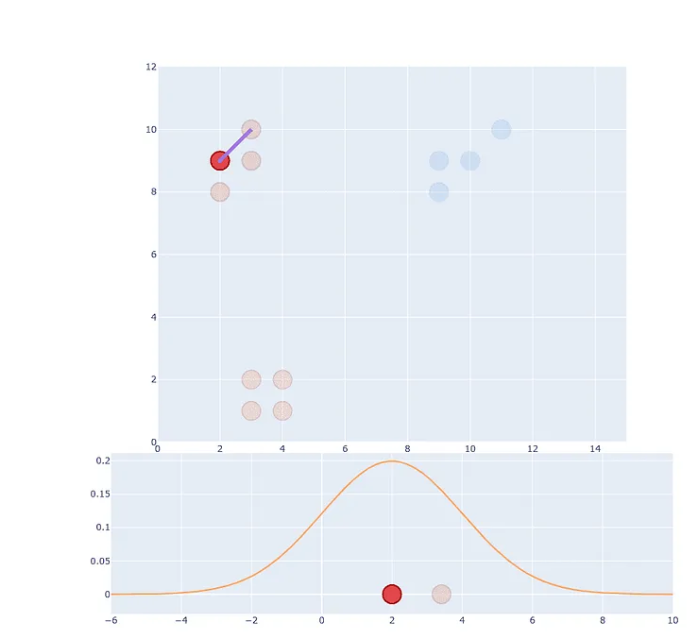

# Lexicon for core concepts of the project

- [Lexicon for core concepts of the project](#lexicon-for-core-concepts-of-the-project)
  - [Dimensionality reduction Techniques](#dimensionality-reduction-techniques)
    - [Principal Component Analysis (PCA)](#principal-component-analysis-pca)
    - [t-distributed stochastic neighbor embedding (TSNE)](#t-distributed-stochastic-neighbor-embedding-tsne)
    - [Comparing t-sne and PCA](#comparing-t-sne-and-pca)
  - [Clustering algorithms](#clustering-algorithms)
    - [DBSCAN](#dbscan)
    - [Ward's Method](#wards-method)
    - [BICO algorithm](#bico-algorithm)
    - [k-means](#k-means)
  - [misceläneus](#misceläneus)
    - [Word Embeddings](#word-embeddings)
    - [Correlation Matrix](#correlation-matrix)
- [Questions](#questions)

## Dimensionality reduction Techniques
> The process of reducing the number of features (or dimensions) in a dataset while retaining as much information as possible

- unsupervised linear dimensionality reduction and data visualization technique for very high dimensional data
- distance in dim. red. plots is not interpretable: any dimensionality reduction technique will distort distances in the plots

**problem:**
- datasets may have more features than observations due to the extreme data avaliability
- causes problems for ml algorithms and there is a higher likelihood for non-relevant datapoints

solution -> reduce the features in the dataset

**concrete usage:**
- reduce the complexity of a model
- to improve the performance of a learning algorithm
- to make it easier to visualize the data

Reduction can be achieved using *feature selection* or *feature extraction*:
  - *feature selection*
    - (manually) select features that are the most relevant using:
      - Filter
      - Wrapper
      - embedded
  - *feature extraction*
    - create new features by combining or extracting original features
    - filter out redundant or low relevance datapoints/features
    - for example: collapsing two highly correlated features like humidity and rainfall

### Principal Component Analysis (PCA)
> map data in a higher dimensional space onto data in a lower dimesional space with maximum variance

**Steps**:
1. Construct the covariance matrix of the data.
   - *Covariance matrix*:
     - is a square matrix, illustrates the variance of dataset elements and the covariance between two datasets
      - *Covariance*:
        - systematic relationship between two random variables in which a change in the other reflects a change in one variable
        - aka how the two variables fluctuate together
        - the greater the covariance, the more reliant the relationship; the smaller the number, the more inverse the relationship
     - *Variance*:
       - measure of dispersion defined as data spread from the provided dataset's mean
2. Compute the eigenvectors of this matrix.
    - *Eigenvectors*:
      - give the characteristics of a vetor or a matrix
      - as far as I understood, eigenvectors are vectors that point in the same direction as the vectors before after scalar transformation
      - `special vectors that maintain their direction despite bullying by the matrices`
3. Eigenvectors corresponding to the largest eigenvalues are used to reconstruct a large fraction of variance of the original data
   - *Eigenvalues*:
     - the scalar that is used to transform (stretch/compress) an Eigenvector
     - represent the directions in which the transformation occurs

**Disadvantages:**
- may lead to data loss
- can only find linear correlations among data
- fails if mean and variance do not define a dataset enough (?)
- **The resulting features are difficult to interpret, especially in regards to the original features**
- if new features are chosen absed on training data, PCA might elad to *overfitting*

Code examples:
- https://necromuralist.github.io/Neurotic-Networking/posts/nlp/pca-dimensionality-reduction-and-word-vectors/index.html
- https://necromuralist.github.io/Neurotic-Networking/posts/nlp/pca-exploration/index.html

### t-distributed stochastic neighbor embedding (TSNE)
> take a set of points in a high-dimensional space and find a faithful representation of those points in a lower-dimensional space, typically the 2D plane

- The algorithm is non-linear and adapts to the underlying data, performing different transformations on different regions
- finds patterns in the data based on the similarity of data points with features, the similarity of points is calculated as the conditional probability that a point A would choose point B as its neighbour.
- unsupervised **non-linear** dimensionality reduction and data visualization technique
- end goal is to have 2 or 3 dimensions
- computes pairwise conditional probabilities and tries to minimize the sum of the difference of the probabilities in higher and lower dimensions
- If you see a t-SNE plot with strange “pinched” shapes, chances are the process was stopped too early

**(Kinda the) Steps**:
1. Create a probability distribution that represents similarities between neighbors.
   - *similarity*:
     - Euclidian distance between two datapoints
   1. Pick a datapoint.
   2. Generate Gaussian (normal) distribution with mean at the datapoint, and place the Euclidian distance on the X-axis
    
   3. Divide the projected probability value (as given by the distribuion) by the number of observations (so that the sum of all proj. probs. is 1)
2. Find a similar distribution in a smaller dimensional space
    - We do not use a *gaussian distribution* again because it is short-tailed which causes a crowding problem
    - instead, we use a *t-tailed distribution* with one degree of freedom
      - *t-distribution*:
        - similar to Normalverteilung, nur dass die Annahme,dass die standardabweichung bekannt ist nict gegeben sein muss
        - je größer die Stichprobe, desto eher ähnelt die t-distribution der Normaldistribution
        - Mitterwert bei 0
        - has a 'short tail' = the tails decay exponentially/quickly
3. Optimize the distribution by using the *KL divergence*
   - *Kullback–Leibler divergence (KL divergence)/ relative entropy*:
     - the difference between one probability distribution from a reference probability distribution

**Parameters**:
- *Perplexity*:
    - how to balance attention between local and global aspects of your data
    - a guess about the number of close neighbors each point has
    - the perplexity really should be smaller than the number of points, suggested range is 5-50

- *learning rate*:
  - usually in the range 10-1000
  - indicates how often the neural network refreshes the notions it has learned

T-sne paper:
- https://www.jmlr.org/papers/volume9/vandermaaten08a/vandermaaten08a.pdf

### Comparing t-sne and PCA
| S.NO. 	|                                          PCA                                          	|                                                         t-SNE                                                        	|
|:-----:	|:-------------------------------------------------------------------------------------:	|:--------------------------------------------------------------------------------------------------------------------:	|
| 1.    	| It is a linear Dimensionality reduction technique.                                    	| It is a non-linear Dimensionality reduction technique.                                                               	|
| 2.    	| It tries to preserve the global structure of the data.                                	| It tries to preserve the local structure(cluster) of data.                                                           	|
| 3.    	| It does not work well as compared to t-SNE.                                           	| It is one of the best dimensionality reduction technique.                                                            	|
| 4.    	| It does not involve Hyperparameters.                                                  	| It involves Hyperparameters such as perplexity, learning rate and number of steps.                                   	|
| 5.    	| It gets highly affected by outliers.                                                  	| It can handle outliers.                                                                                              	|
| 6.    	| PCA is a deterministic algorithm.                                                     	| It is a non-deterministic or randomised algorithm.                                                                   	|
| 7.    	| It works by rotating the vectors for preserving variance.                             	| It works by minimising the distance between the point in a gaussian.                                                 	|
| 8.    	| We can find decide on how much variance to preserve using eigen values.               	| We cannot preserve variance instead we can preserve distance using hyperparameters.                                  	|
| 9.    	| PCA is computationally less expensive than t-SNE, especially for large datasets.      	| t-SNE can be computationally expensive, especially for high-dimensional datasets with a large number of data points. 	|
| 10.   	| It can be used for visualization of high-dimensional data in a low-dimensional space. 	|  It is specifically designed for visualization and is known to perform better in this regard.                        	|
| 11.   	| It is suitable for linearly separable datasets.                                       	| It is more suitable for non-linearly separable datasets.                                                             	|
| 12.   	| It can be used for feature extraction                                                 	| It is mainly used for visualization and exploratory data analysis.                                                   	|
| 13.   	| PCA can be sensitive to the ordering of the data points                               	| t-SNE is less sensitive to the ordering of the data points.                                                          	|

## Clustering algorithms

### DBSCAN

### Ward's Method

### BICO algorithm

### k-means
vector quantization or K‐means [Hartigan1979]
https://www.geeksforgeeks.org/k-means-clustering-introduction/

## misceläneus
To look up:
- Min. cost flow problem (Englische Beschreibung aus der Mail as well)
  - minimum mean cycle cancelling
    - alternatives: capacity scaling algorithm or cost scaling algorithm
- syncretic matrix
- bipartiter Graph
  - in einem Graph werden die nodes (runde Punkte) auch Vertex genannt
  - ein directed graph hat Pfeile, die die ndoes verbinden
  - in einem bipartitem Graph kann man die Vertices in zwei disjoint, independent sets

### Word Embeddings

- words need o be encoded into a numerical format in roder to the computer to be able to understand/work with it
- since the meaning of words can differ in different contexts

### Correlation Matrix
- contains correlation coefficients among datapoints
    - *correlation*:
      - the degree to which two or more random variables move in sequence/are related

*Correlation versus covariance*:

| Basis for comparison 	| Covariance                                                                                                                                   	| Correlation                                                                                 	|
|----------------------	|----------------------------------------------------------------------------------------------------------------------------------------------	|---------------------------------------------------------------------------------------------	|
| Definition           	| Covariance is an indicator of the extent to which 2 random variables are dependent on each other. A higher number denotes higher dependency. 	| Correlation is a statistical measure that indicates how strongly two variables are related. 	|
| Values               	| The value of covariance lies in the range of -∞ and +∞.                                                                                      	| Correlation is limited to values between the range -1 and +1                                	|
| Change in scale      	| Affects covariance                                                                                                                           	| Does not affect the correlation                                                             	|
| Unit-free measure    	| No                                                                                                                                           	| Yes                                                                                         	|

# Questions
- Why PCA and tsne instead of SVD or LDA?
- What does the writ-up (Projektbericht) look like?

Sources:
- https://www.geeksforgeeks.org/dimensionality-reduction/
- https://arxiv.org/pdf/1403.2877.pdf
- https://www.simplilearn.com/covariance-vs-correlation-article#:~:text=What%20Is%20A%20Covariance%20Matrix,What%20Is%20A%20Correlation%20Matrix%3F&text=Covariance%20and%20correlation%20are%20two,the%20two%20variables%20are%20related.
- https://math.stackexchange.com/questions/36815/a-simple-explanation-of-eigenvectors-and-eigenvalues-with-big-picture-ideas-of
- https://www.geeksforgeeks.org/difference-between-pca-vs-t-sne/?ref=gcse
- https://distill.pub/2016/misread-tsne/
- https://towardsdatascience.com/t-sne-clearly-explained-d84c537f53a
- https://scikit-learn.org/stable/modules/generated/sklearn.manifold.TSNE.html#:~:text=The%20learning%20rate%20for%20t,dense%20cloud%20with%20few%20outliers.